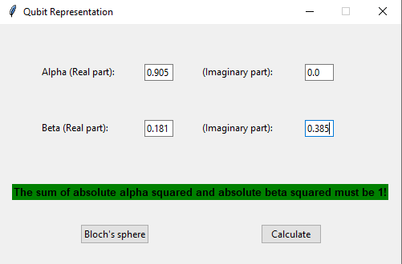
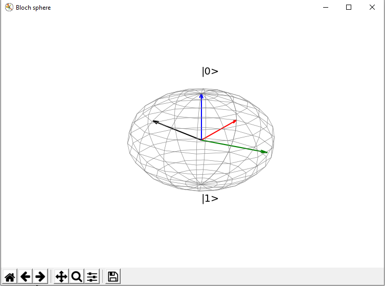
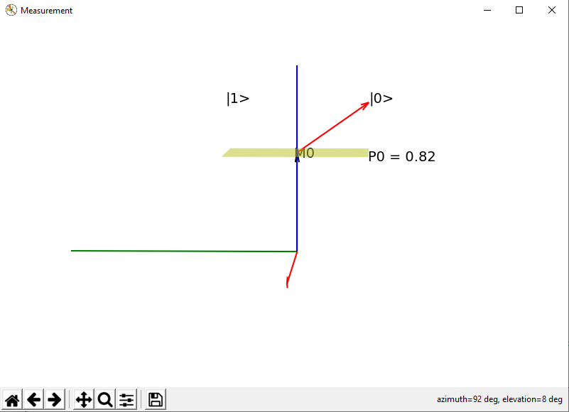

# QubitRepresentation

Representation of a qubit on a Bloch sphere and measurement simulation.

Prerequisites:
- Python 3
- numpy
- matplotlib

# Instalation of additional libraries:

Type in a terminal or command line:

``` pip3 install numpy```

```pip3 install matplotlib```

# Input Screen



# Bloch representation



# Measurement


